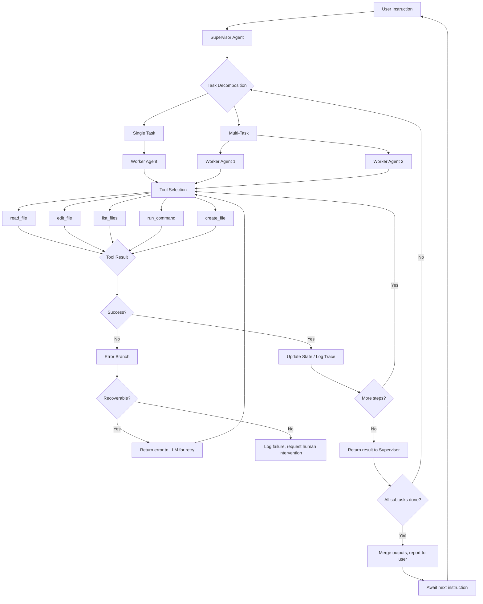

# PRESEARCH.md — Shipyard: Building an Autonomous Coding Agent

> Completed: 2026-03-23
> Author: [Your Name]

---

## Phase 1: Open Source Research

### Agent 1: OpenCode (github.com/opencode-ai/opencode)

**What I read:** Agent loop structure, tool definitions, file editing implementation, context window management.

**How it handles file editing:**
- Uses an anchor-based replacement strategy — finds a unique block of text in the file, replaces it with the new version
- The tool receives `old_text` (the exact text to find) and `new_text` (the replacement)
- Tradeoff: requires the LLM to reproduce the exact existing text, which can fail on long blocks
- Failure mode: if `old_text` doesn't match exactly (whitespace, encoding), the edit silently fails or throws

**How it manages context across turns:**
- Maintains a conversation history with tool results appended
- Uses a sliding window approach — older messages are summarized or truncated when approaching token limits
- File contents are read on-demand (not pre-loaded), keeping the context window focused

**How it handles failed tool calls:**
- Returns error messages to the LLM as tool results
- The LLM can retry with corrected parameters
- No automatic retry logic — the agent loop naturally handles it by letting the LLM see the error and self-correct

**What I would take from it:**
- The `old_text` → `new_text` replacement pattern is clean and language-agnostic
- On-demand file reading is the right approach — don't pre-load the entire codebase
- Letting the LLM see error messages and self-correct is simpler than building retry logic

**What I would do differently:**
- Add a fuzzy matching fallback when exact match fails (e.g., ignore whitespace differences)
- Implement a verification step — after editing, re-read the file and confirm the edit landed correctly
- Add line numbers to file reads so the LLM can reference specific locations

---

### Agent 2: Claude Code (docs.anthropic.com/claude-code)

**What I read:** Architecture overview, permission model, sub-agent coordination, human-in-the-loop design.

**How it handles file editing:**
- Uses a dedicated `Edit` tool that performs exact string replacement in files
- Requires `old_string` to be unique in the file — fails if ambiguous
- Supports `replace_all` for renaming across a file
- Also has a `Write` tool for creating new files (full content)

**How it manages context across turns:**
- Automatic context compression as the conversation approaches limits
- System prompt includes project-specific instructions (CLAUDE.md files)
- Memory system for persisting information across sessions

**How it handles failed tool calls:**
- Returns errors to the agent loop
- Agent can adjust approach based on error feedback
- Human-in-the-loop: permission system lets the user approve/deny actions

**What I would take from it:**
- The "old_string must be unique" constraint is a good guardrail — forces the LLM to provide enough context
- Separate Read and Edit tools (don't combine them)
- The permission model idea — for the Ship rebuild, having a "confirm before applying" mode could prevent bad edits

**What I would do differently:**
- Claude Code is a full product with many features — I need to strip down to the essential loop
- Skip the complex permission system for MVP — just log everything
- Don't need the memory system — context injection handles session state

---

### File Editing Strategy Decision

**Chosen strategy: Anchor-based replacement**

**Why:**
- Language-agnostic — works on Python, TypeScript, JSON, YAML, anything
- More robust than line numbers (which drift after every edit)
- Simpler to implement than AST parsing (no language-specific parsers needed)
- LLMs are good at identifying unique text blocks in files
- Directly inspired by how OpenCode and Claude Code handle edits

**Failure modes and mitigations:**
| Failure Mode | Mitigation |
|---|---|
| Anchor not found (text doesn't exist in file) | Return error to LLM with file contents; let it re-identify the block |
| Anchor not unique (matches multiple locations) | Return all match locations with surrounding context; ask LLM to provide a longer/more specific anchor |
| Edit produces syntax errors | After edit, run a syntax check (language-specific); if it fails, revert and report |
| LLM hallucinates file content | Always read the file first; include line numbers in the read output so the LLM works from ground truth |

---

## Phase 2: Architecture Design

### 3. System Diagram



### 4. File Editing Strategy — Step by Step

1. **Read**: Agent calls `read_file(path)` → returns file contents with line numbers
2. **Identify**: LLM analyzes the file and identifies the exact block that needs to change
3. **Anchor**: LLM provides `old_text` — a unique string from the file that contains the target block
4. **Generate**: LLM provides `new_text` — the replacement for that block
5. **Validate uniqueness**: The tool checks that `old_text` appears exactly once in the file
6. **Apply**: Replace `old_text` with `new_text` in the file
7. **Verify**: Re-read the file and confirm the edit was applied correctly
8. **Log**: Record the edit in the trace (file, old_text, new_text, success/failure)

**When the agent gets the location wrong:**
- The `old_text` won't match anything in the file → tool returns an error with the actual file content
- The LLM sees the error, re-reads the file, and tries again with the correct anchor
- After 3 failed attempts on the same edit, escalate to the user with the file content and proposed change

### 5. Multi-Agent Design — Supervisor + Workers

**Orchestration model:** Supervisor-Worker pattern via LangGraph

```
┌─────────────────────────────────────┐
│           SUPERVISOR AGENT          │
│  - Receives user instruction        │
│  - Decomposes into subtasks         │
│  - Dispatches to workers            │
│  - Merges results                   │
│  - Manages shared state             │
└──────────┬──────────┬───────────────┘
           │          │
    ┌──────▼──┐  ┌────▼────┐
    │ WORKER  │  │ WORKER  │
    │ (back-  │  │ (front- │
    │  end)   │  │  end)   │
    │         │  │         │
    │ Tools:  │  │ Tools:  │
    │ read    │  │ read    │
    │ edit    │  │ edit    │
    │ run_cmd │  │ run_cmd │
    └─────────┘  └─────────┘
```

**Communication:** Workers don't talk to each other directly. All communication flows through the Supervisor via LangGraph's shared state object.

**Output merging:** Each worker writes to separate files (backend writes to `api/`, frontend writes to `web/`). The Supervisor validates no conflicts exist. If workers need to share types (e.g., `shared/` directory), the Supervisor sequences those edits.

**Conflict resolution:** If two workers try to edit the same file, the Supervisor detects this and serializes the edits (worker A goes first, worker B gets the updated file).

### 6. Context Injection Spec

**Types of context:**
| Context Type | Format | Example |
|---|---|---|
| Specification | Markdown text | Ship app PRD, feature requirements |
| Schema | JSON / SQL | Database schema, API schema |
| Previous output | Text | Test results, build errors, prior agent output |
| File content | Text with line numbers | Reference implementation files |

**Injection point:** Context is injected as a system message prepended to the next LLM call. It does NOT replace the conversation history — it augments it.

**Format:** All injected context is wrapped in XML-style tags:
```
<injected_context type="specification" source="ship_prd.md">
[content here]
</injected_context>
```

**When in the loop:** Context can be injected:
- Before a new instruction (proactive — "here's the spec, now build X")
- Mid-execution (reactive — "here's the test output, the build failed")
- Via a `/context` command in the REPL

### 8. Additional Tools

| Tool | Description |
|---|---|
| `read_file(path)` | Read a file and return contents with line numbers |
| `edit_file(path, old_text, new_text)` | Anchor-based surgical replacement |
| `create_file(path, content)` | Create a new file with full contents |
| `list_files(directory, pattern?)` | List files in a directory, optionally filtered by glob pattern |
| `run_command(command)` | Execute a shell command and return stdout/stderr |
| `search_files(pattern, directory?)` | Grep-style search across files |

---

## Phase 3: Stack and Operations

### 9. Framework Choice

**LangGraph** for the agent loop and multi-agent coordination.

**Why:**
- Built-in state machine model maps directly to an agent loop (nodes = actions, edges = transitions)
- First-class multi-agent support via sub-graphs
- Automatic LangSmith tracing with zero configuration
- Recommended by the PRD
- Python-native — largest ecosystem of examples and documentation

### 10. Persistent Loop

The agent runs as a Python process with a REPL-style input loop:

```
while True:
    instruction = input(">>> ")  # or read from stdin/queue
    if instruction == "/quit":
        break
    result = graph.invoke({"instruction": instruction, "context": current_context})
    print(result)
```

**Kept alive:** The Python process stays running between instructions. State is maintained in the LangGraph state object (in-memory). No external state store needed for MVP — the process IS the state.

**For production:** Could be wrapped in a FastAPI server with WebSocket for continuous instruction streaming.

### 11. Token Budget

| Budget Item | Estimate |
|---|---|
| Input tokens per invocation | ~4,000 (instruction + file contents + context) |
| Output tokens per invocation | ~2,000 (tool calls + reasoning) |
| Claude Sonnet cost per invocation | ~$0.024 input + $0.030 output = ~$0.054 |
| Budget per session (100 invocations) | ~$5.40 |

**Cost cliffs:**
- Reading large files (>500 lines) inflates input tokens significantly
- Injecting full specifications (like the Ship PRD) costs ~2,000 tokens per turn
- Multi-agent runs multiply costs linearly (2 agents = 2x per step)
- Claude Opus would be 5x more expensive — use Sonnet for development, Opus only if Sonnet fails

### 12. Bad Edit Recovery

1. **Detection:** After every edit, re-read the edited file. If the expected change isn't present, the edit failed.
2. **Syntax check:** Run a language-appropriate syntax check (`python -c "compile(...)"`, `node --check`, `tsc --noEmit`).
3. **Revert:** If the syntax check fails, revert the file to the pre-edit state (keep a backup before each edit).
4. **Retry:** Return the error to the LLM with the current file state. Allow up to 3 retry attempts.
5. **Escalate:** After 3 failures, present the file and proposed change to the user for manual resolution.

### 13. Trace Logging

A complete run trace for a typical edit looks like:

```json
{
  "trace_id": "run_abc123",
  "timestamp": "2026-03-23T14:30:00Z",
  "instruction": "Add a /health endpoint to api/routes/index.ts",
  "steps": [
    {
      "step": 1,
      "action": "read_file",
      "input": {"path": "api/routes/index.ts"},
      "output": {"lines": 45, "content": "..."},
      "tokens": {"input": 1200, "output": 800},
      "duration_ms": 1500
    },
    {
      "step": 2,
      "action": "edit_file",
      "input": {
        "path": "api/routes/index.ts",
        "old_text": "export default router;",
        "new_text": "router.get('/health', (req, res) => res.json({ status: 'ok' }));\n\nexport default router;"
      },
      "output": {"success": true, "lines_changed": 2},
      "tokens": {"input": 1500, "output": 600},
      "duration_ms": 2000
    },
    {
      "step": 3,
      "action": "run_command",
      "input": {"command": "node --check api/routes/index.ts"},
      "output": {"exit_code": 0, "stdout": ""},
      "duration_ms": 500
    }
  ],
  "total_tokens": {"input": 3700, "output": 1400},
  "total_duration_ms": 4000,
  "result": "success"
}
```

**What gets logged:**
- Every tool call with inputs and outputs
- Token usage per step and total
- Duration per step and total
- Final result (success/failure/intervention_required)
- Any errors encountered and how they were resolved
